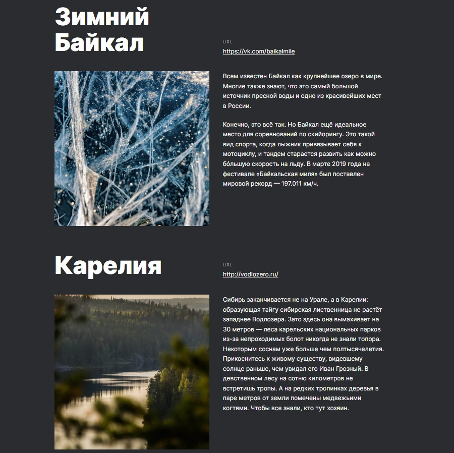

# Проект Путешествия по России

<kbd>  </kbd>

### Описание:
Это проект про путешествия по России. Рассказы про интересные места.

[Макет проекта в Figma](https://www.figma.com/file/NLsuf5zh47919SK58bBidw/Sprint-3_-Russia-_-desktop-%2B-mobile?node-id=28503%3A0 "ссылка на макет")

### Стек технологий:

| HTML <code></code> | CSS <code></code> |
|---|---|

>  В проекте активно используются `Flex`, `Grid`, `позиционирование`, `псевдоэлементы`, `псевдоклассы`,`БЭМ` и т.д.

### Инструкция по установке:
1. Установите [Node.js](https://nodejs.org/en/ "ссылка на сайт Node.js")
2. Установите [Git](https://git-scm.com/ "ссылка на сайт Git")
3. Скачайте архив данного репозитория или склонируйте себе при помощи команды:
```sh
git clone https://github.com/koshmar1319/russian-travel.git
```
4. Запустите проект локально. Если вы работаете в VS Code, можете использовать плагин [Live Server](https://marketplace.visualstudio.com/items?itemName=ritwickdey.LiveServer "ссылка на плагин"), например.

### Демо:
> Github Pages <br/>[Ссылка на сайт :arrow_lower_right:](https://koshmar1319.github.io/russian-travel/index.html "ссылка на сайт")
